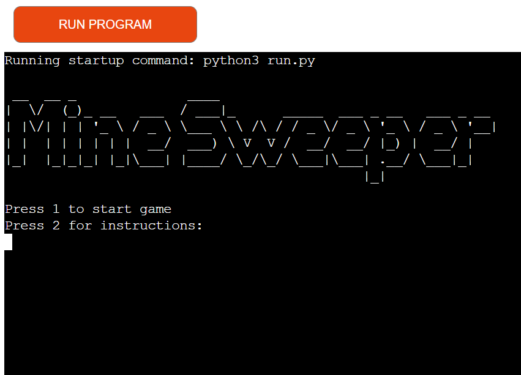
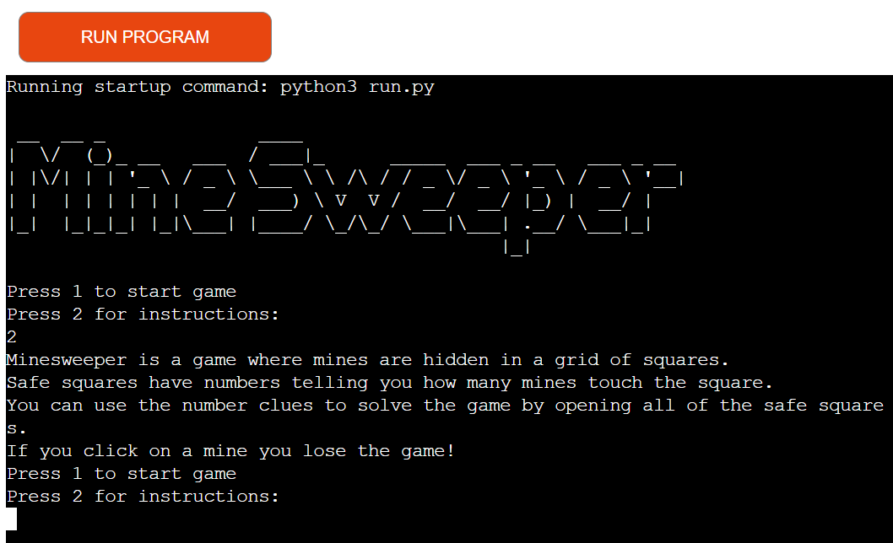
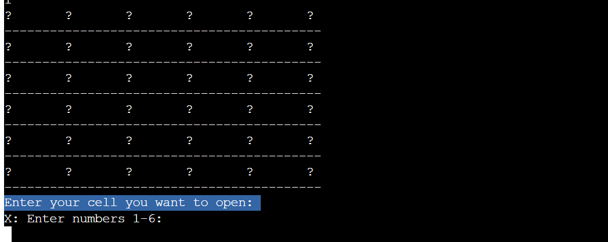
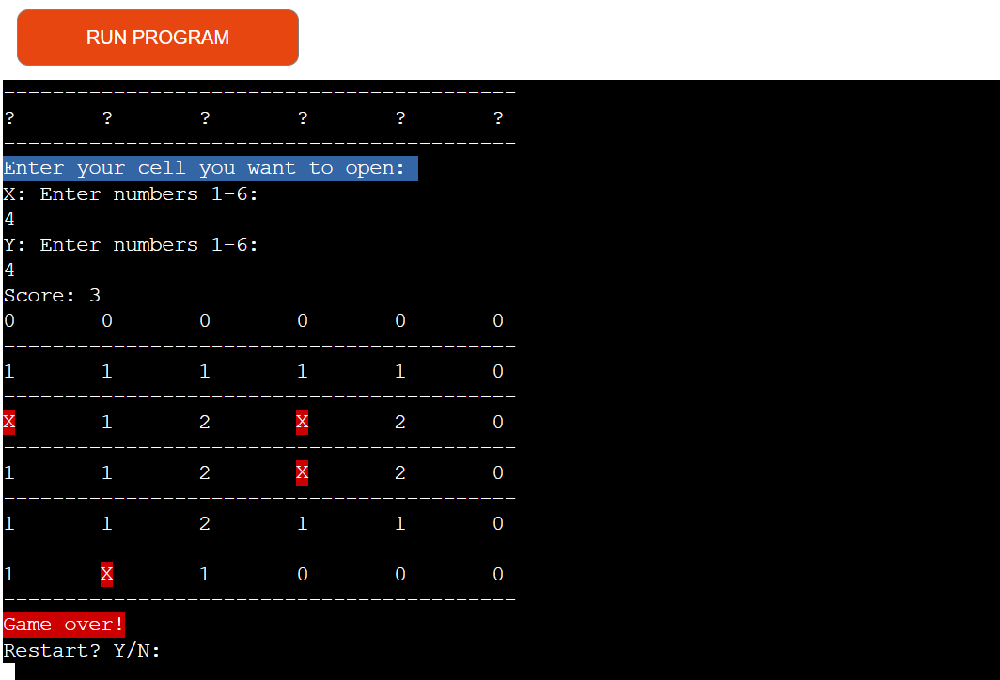
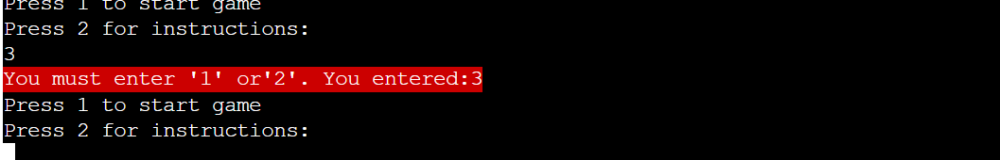
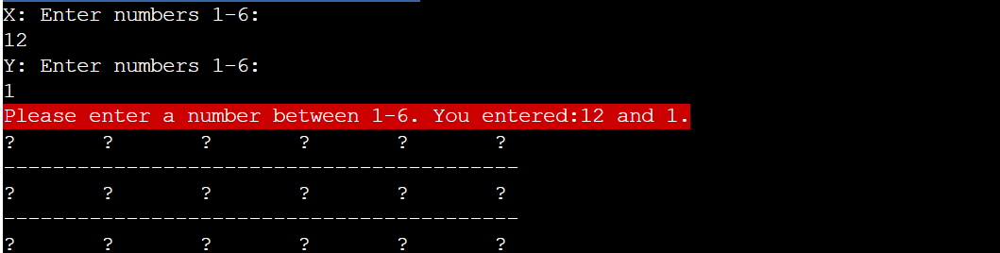
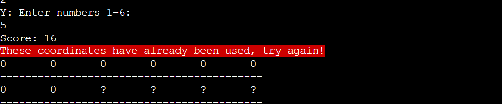
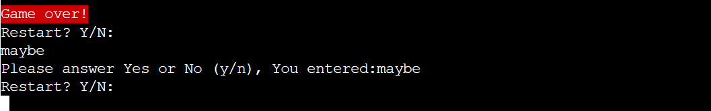
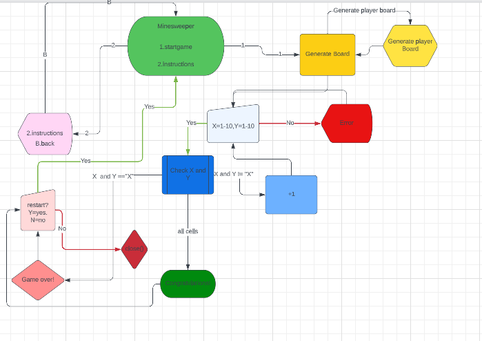
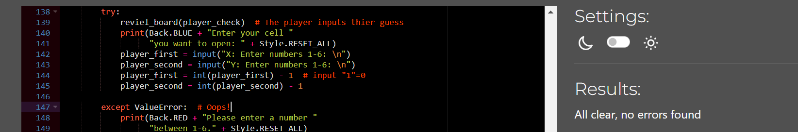

# Welcome to MineSweeper! 
## This is an app for you who want to train your cognitive ability.
Minesweeper is a game for people of all ages, here you can train your cognitive skills or just pass the time, maybe before the next meeting.
### Start Heading.
<br>
* The title should make it clear to the user which game he or she is playing, as well as give an aesthetic expression.
* The player has two choices, start the game or choose to read instructions before he or she starts playing.
### Instructions.
<br>
Instructions give the player a chance to read up on what the game is about and gain an understanding of the rules of the game.

### Minesweeper board.
<br>
Here we see 6 by 6 symbols and behind some of these symbols there are bombs hiding.

### Inputs X and Y.
* The app asks for 2 inputs, one on the x-axis and one on the y-axis.
* if the player has not clicked on a bomb, the game continues and the player gets a point.
* If the player reaches 32 points, the player wins and can then choose whether to restart or end the game.

### Restart.
<br>
If the player clicks on a bomb, the player is given an option to choose to restart or quit the game.

## Error catching.
In order to prevent the game from crashing, a lot of time has been spent on making sure that the player cannot submit values ​​that cause the app to crash, but at the same time reduce user misunderstandings. The last thing we want is for the player not to believe that the game works as it should.

### Error catch 1(Start game/ Instructions).
<br>
The app asks for a variable either "1" or "2" the player presses something else a message is displayed explaining what is wrong and letting the player try again.

### Error catch 2 (Input X and Y).
<br>
<br>
The app asks the player to enter a number between 1-6 on the x-axis and a number between 1-6 on the y-axis. If the player writes, for example, a letter, the player is informed that the game is looking for a number between 1-6.
If the player uses the same coordinates multiple times, the app will react to that as well.
### Error catch 3 (Restart).
<br>
The player has clicked on a bomb which means the game is over. he or she is asked if you want to continue playing or quit. The player must then enter "y" or "n" if the player writes something else, for example a number or several letters, a warning message will be displayed.
### Existing features.
* input validation
* offset logic
* Restart function
### Features left to implement.
* Difficulty setting.
* Score board.
### Technologies.
* Python
    * The structure of the app was developed using Python as the main language.
* Git
    * Used to commit and push code during the development of the Website
* Git hub
    * Source code is hosted on GitHub.
* Heroku
    * The app is deployed with Heroku
# Testing.
## Manual testing.
### Test cells:
| Test Item          | Method |  Input details | Desired Result                          | Result     | Pass |
| ------------------ | ------ | -------------- | --------------------------------------- | ---------- | ---- |
| Command Line Input | Input  |      x=1 y=1   | The corresponding cell will display a 0 | As desired | Yes  |
| Command Line Input | Input  |      x=2 y=2   | The corresponding cell will display a 0 | As desired | Yes  |
| Command Line Input | Input  |      x=3 y=3   | The corresponding cell will display a 0 | As desired | Yes  |
| Command Line Input | Input  |      x=4 y=4   | The corresponding cell will display a 0 | As desired | Yes  |
| Command Line Input | Input  |      x=5 y=5   | The corresponding cell will display a 0 | As desired | Yes  |
| Command Line Input | Input  |      x=6 y=6   | The corresponding cell will display a 0 | As desired | Yes  |

All cells were checked with no issues.

### Test cells X = symbols, dubble numbers and letters.
| Test Item          | Method |  Input details | Desired Result                          | Result     | Pass |
| ------------------ | ------ | -------------- | --------------------------------------- | ---------- | ---- |
| Command Line Input | Input  |      x=! y=1   | Error message                           | As desired | Yes  |
| Command Line Input | Input  |      x=" y=1   | Error message                           | As desired | Yes  |
| Command Line Input | Input  |      x=# y=1   | Error message                           | As desired | Yes  |
| Command Line Input | Input  |      x=¤ y=1   | Error message                           | As desired | Yes  |
| Command Line Input | Input  |  x=blank y=1   | Error message                           | As desired | Yes  |
| Command Line Input | Input  |     x=11 y=1   | Error message                           | As desired | Yes  |
| Command Line Input | Input  |      x=a y=1   | Error message                           | As desired | Yes  |
| Command Line Input | Input  |      x=[ y=1   | Error message                           | As desired | Yes  |
| Command Line Input | Input  |      x=0 y=1   | Error message                           | As desired | Yes  |
| Command Line Input | Input  |    x="1" y=1   | Error message                           | As desired | Yes  |

All cells were checked with no issues.

### Test cells Y = symbols, dubble numbers and letters.
| Test Item          | Method |  Input details | Desired Result                          | Result     | Pass |
| ------------------ | ------ | -------------- | --------------------------------------- | ---------- | ---- |
| Command Line Input | Input  |      x=1 y=-7  | Error message                        |not as desired | No   |
| Command Line Input | Input  |      x=1 y=!   | Error message                           | As desired | Yes  |
| Command Line Input | Input  |      x=1 y="   | Error message                           | As desired | Yes  |
| Command Line Input | Input  |      x=1 y=#   | Error message                           | As desired | Yes  |
| Command Line Input | Input  |      x=1 y=¤   | Error message                           | As desired | Yes  |
| Command Line Input | Input  |      x=1 y=%   | Error message                           | As desired | Yes  |
| Command Line Input | Input  |   x=1 y=blank  | Error message                           | As desired | Yes  |
| Command Line Input | Input  |      x=1 y=11  | Error message                           | As desired | Yes  |
| Command Line Input | Input  |      x=1 y="1" | Error message                           | As desired | Yes  |
| Command Line Input | Input  |      x=1 y=a   | Error message                           | As desired | Yes  |

When testing the inputs i found that when entering -7 broke the game this was fixed by adding this code on line 156:
```
if 0 <= player_first <= 5 and 0 <= player_second <= 5:
```
### Lucidchart.
<br>
Something that I have found very useful is Lucidchart. Lucidchart has helped a lot in that I've been able to draw out how I intended my app to work and how the logic should flow, every time I've gotten stuck I've always been able to use my Lucidchart to get back on track.

### Validator Testing
- CI Python Linter
  - No errors were returned when passing through [CI Python Linter](https://pep8ci.herokuapp.com/#)
  
### Bugs
I have had a lot of trouble with a bug in the offset logic. It manifested itself by giving too many points to the numbers around a bomb. I then lowered the number of bombs on the playing field and added this code on line 64:<br>
```
if x and y == x and y:
            x = random.randint(0, n-1)
            y = random.randint(0, n-1)
```
At the time of writing, I have tested this function perhaps 20 times with approved results.
### Unfixed Bugs.
No unfixed bugs.
### Deployment.
The following git commands were used throughout development to push code to the remote repo:

```git add <file>``` - This command was used to add the file(s) to the staging area before they are committed.<br>
```git commit -m “commit message”``` - This command was used to commit changes to the local repository queue ready for the final step.<br>
```git push``` - This command was used to push all commited code to the remote repository on github.
### Deployment
- Use the following steps to deploy the poject to Heroku:
1. Use the "pip freeze -- local > requirements.txt" command in the gitPod terminal; to save any libraries that need to be installed to the project files in Heroku.
2. Login or create a Heroku account.
3. Click the "New" button in the upper right corner and select "Create New App".
4. Choose an app name and your region and click "Create App". Note: the app name must be unique.
5. Go to the "Settings" tab, add the python build pack and then the node.js build pack. This is to ensure the project functions correctly with the Code Institute pre-installed template.
6. Create a "Config VAR" with the 'CREDS' key and the enter the value of the creds.json file.
7. Create a second "Config VAR" with the key of 'PORT' and value of '8000'
8. Go to the "Deploy" tab and pick GitHub as a deployment method.
9. Search for a repository to connect to.
10. Click enable automatic deploys and then deploy branch.
11. Wait for the app to build and then click on the "View" link. 

The live link can be found [here](https://minesweeper-project3.herokuapp.com/).

### Clone the Repository Code Locally
Navigate to the GitHub Repository you want to clone to use locally:
- Click on the code drop down button
- Click on HTTPS
- Copy the repository link to the clipboard
- Open your IDE of choice (git must be installed for the next steps)
- Type git clone copied-git-url into the IDE terminal
The project will now been cloned on your local machine for use.
### Credit.
* I have used the code for the offset logic from: [Medium](https://medium.com/swlh/this-is-how-to-create-a-simple-minesweeper-game-in-python-af02077a8de)
* I have used [w3schools](https://www.w3schools.com/) a lot for inspiration and tips and tricks